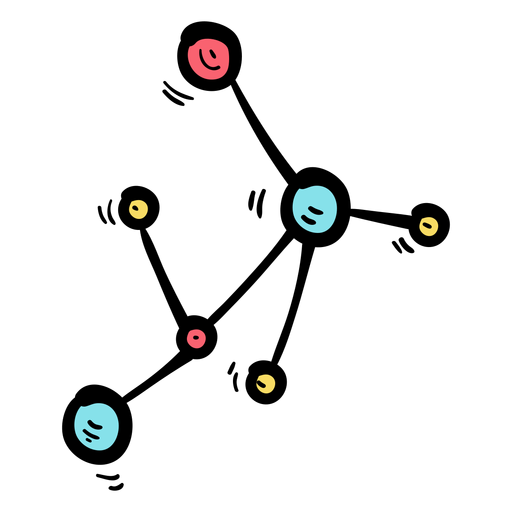
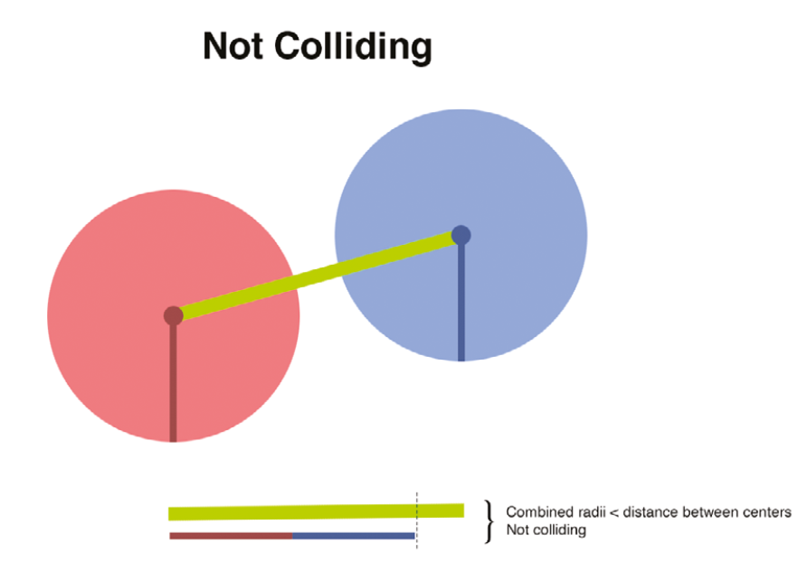
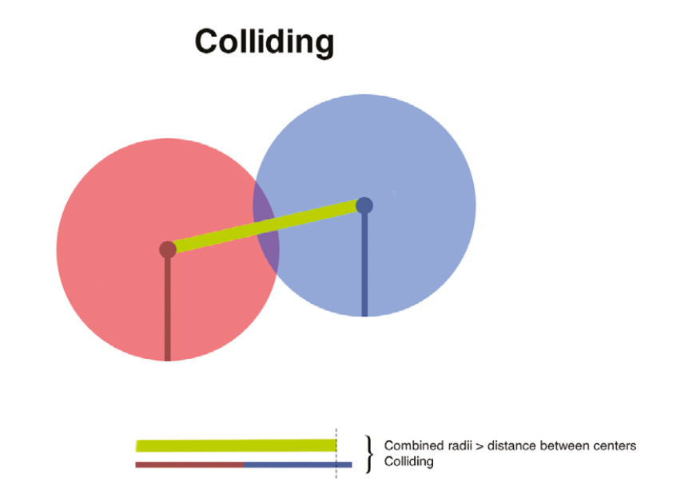

<h1 align="center"> AP course project  </h1>

    
    
    
    
    
    
    
    

<!-- PROJECT LOGO -->
 

  <h3 align="center"> Collision🔮</h3>
  

  

   A Simulating of object collisions designed with Pygame (Python)
     
    <a href="https://github.com/RabihND/collision_simulation"><strong>Explore the documents »</strong></a>
     
     
  

---

<!-- TABLE OF CONTENTS -->

  
Table of Contents
 
  <ol>
    <li><a href="#about-the-project">About The Project</a></li>
    <li><a href="#parts">Parts</a></li>
    <li><a href="#results">Results</a></li>
    <li><a href="#license">License</a></li>
    <li><a href="#refenences">Refenences</a></li>
    <li><a href="#contact">Contact</a></li>
    <li><a href="#roadmap">Roadmap</a></li>
  </ol>

<!-- ABOUT THE PROJECT -->
## About The Project

  
  
<b> Circles which can bounce off one another if they collide.</b>

> Our training will be based on **simple circles**.

<b># What are we making? </b>

We can modify the characteristics of the circles to reflect the qualities they represent: We can use circles to make it simpler to use arithmetic to compute collisions, and we can change the properties of the circles to reflect the qualities they represent: More bulk, for example, or a larger radius.

(<a href="#top">back to top</a>)

### Built With

Major frameworks/libraries used in this project:

* [Python 3.x](https://www.python.org/)
* [Pygame](https://www.pygame.org/news)

(<a href="#top">back to top</a>)

<!-- PARTS -->
## Parts
**1. What do we need to know to simulate a collision?**

<i>"Before we can simulate a collision, we need to know a few things."</i> 

First, we must determine which, if any, two objects are colliding.We need to find out how fast the two items are colliding, the angle of incidence , and the mass of each of the objects once we know which two things are colliding. 

 
**2. So, how can we figure out which objects are colliding?** 

When you utilize circles, it's quite basic. Every point around the circumference is the same distance from the center as every other point; the radius is the measurement from the edge to the center. We can tell if two items' outlines meet by calculating the distance between their centers. We can deduce that two circles are colliding if the distance between their centers is smaller than the radius of each circle combined together.

  

    
  

  

    
  

 

**3. GameOverWindow Class** (GUI_Window)

The resulting window, which shows the player's loss(+) or victory(-).
- **display_text()**: Return a text with include the result of the game.(Win/Loss)

**4. Splash Screen Class** (GUI_Windows)
>{⌛} 

(<a href="#top">back to top</a>)

<!-- RESULTS -->
## Results

**GUI OUTPUT:**

ScreenShoot Preview 🖼️

  <body>
    
  

  </body>

---

**TERMINAL OUTPUT:**

ScreenShoot Preview 🖼️

  <body>
    
  

  </body>

(<a href="#top">back to top</a>)

<!-- LICENSE -->
## License

Distributed under the MIT License. See `LICENSE.txt` for more information.

(<a href="#top">back to top</a>)

<!-- REFERENCES -->
## Refenences

🔎

(<a href="#top">back to top</a>)

<!-- CONTACT -->
## Contacts

Rabih ND - [@RabihND](https://github.com/RabihND) 

Hasan Sanei - [@hasansanei](https://github.com/hasansanei)

**Project Link:** [https://github.com/RabihND/AP2021-2022-Final](https://github.com/RabihND/AP2021-2022-Final)

(<a href="#top">back to top</a>)

<!-- ROADMAP -->
## Roadmap

- [x] Write the main code-map.
- [x] Design the GUI window. 
- [x] Write the MasterMain Core Functions.
- [x] Design the GameOver window.
- [x] <a href="https://github.com/RabihND/AP2021-2022-Final/releases/latest"><strong>Build the .EXE Release</strong></a>
- [ ] Splash screen
- [ ] Build APK release.

(<a href="#top">back to top</a>)

---

<b>
Amirkabir University  of Technology</b>

(Tehran Polytechnic)

